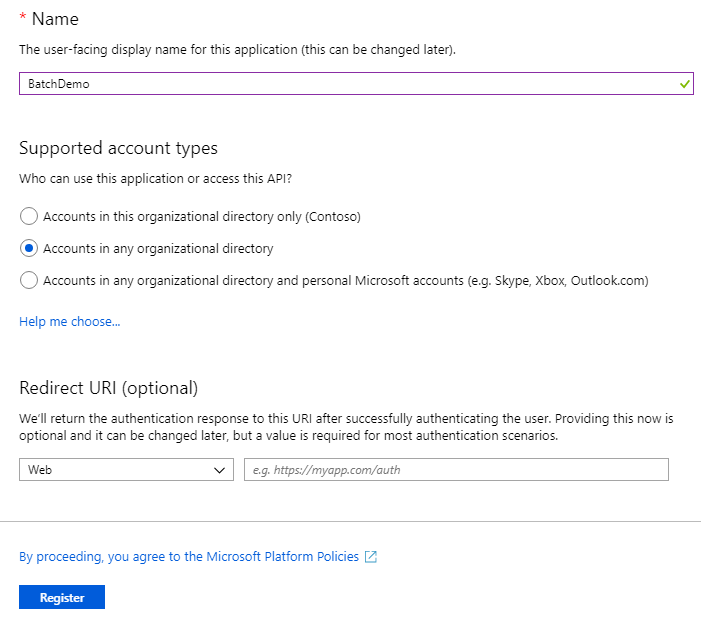
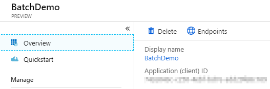
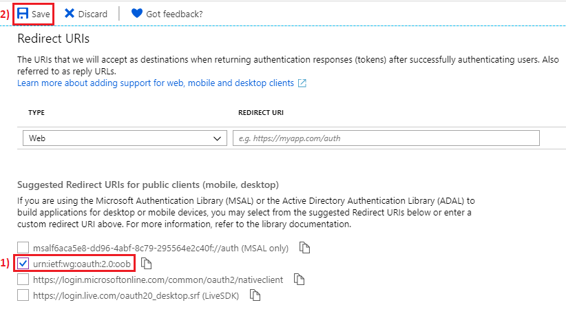
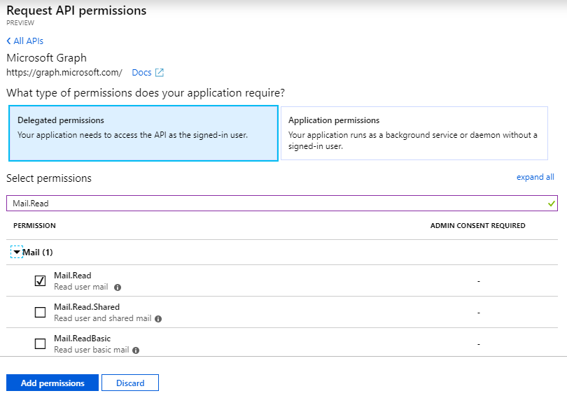
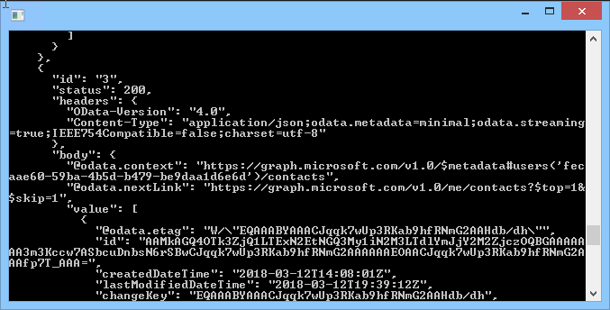

# Creating batch requests with Microsoft Graph

This demo will show how to use the batch resource with Microsoft Graph.

## Pre-requisites

This demo requires an Office 365 user.

## Register the application

1. Open a browser and navigate to the [Azure Active Directory admin center](https://aad.portal.azure.com). Login using a **Work or School Account**.

1. Select **Azure Active Directory** in the left-hand navigation, then select **App registrations (Preview)** under **Manage**.

    

1. Select **New registration**. On the **Register an application** page, set the values as follows.

    - Set a preferred **Name** e.g. `BatchDemo`.
    - Set **Supported account types** to **Accounts in any organizational directory**.

    

1. Choose **Register**. On the **BatchDemo** app page, select **Overview** and copy the value of the **Application (client) ID** and save it, you will need it in the next step.

    

1. Still on the app page, select **Authentication**. Locate the section **Redirect URIs**. In the _Suggested Redirect URIs for public clients(mobile,desktop)_, check the second box so that the app can work with the MSAL libraries used in the application. (The box should contain the option _urn:ietf:wg:oauth:2.0:oob_). Choose **Save**.

    

1. From the app page, select **API permissions** > **Add a permission**.

    

1. Choose **Microsoft API** > **Microsoft Graph**.

    

1. Choose **Delegated permissions**. In the search box, type **Mail.Read** and select the first option from the list.

    

1. Repeat the above step (8) for the **Calendars.Read** and **Contacts.Read** permissions. Select **Add permissions**.

## Create the application

1. In Visual Studio 2017, create a new project using the **Console App (.NET Framework)** project template.

1. Right-click the project node and choose **Manage NuGet packages**.

1. Select the Browse tab and ensure the **Include pre-release** checkbox is checked.

1. Search for **Microsoft.Identity.Client** version `1.1.4-preview00002` and select **Install**.

1. Select the Browse tab and search for **Newtonsoft.Json**. Select **Install**.

1. Right-click the **References** node in the project and choose **Add Reference**.

1. Add a reference for **System.Configuration**.

1. Update the **app.config** file and add an `appSettings` section as a child of the `configuration` element with the following structure:

    ```xml
    <appSettings>
        <add key="ida:clientId" value=""/>
    </appSettings>
    ```

    **Update** the `ida:clientId` setting with the Application ID of the application you previously registered.

    **Replace** the contents of `Program.cs` with the following:

    ```csharp
    using System.Configuration;
    using System.Threading.Tasks;

    namespace Batch
    {
        class Program
        {
            static void Main(string[] args)
            {
                RunAsync(args).GetAwaiter().GetResult();
            }

            static async Task RunAsync(string[] args)
            {

                var clientId = ConfigurationManager.AppSettings["ida:clientId"];

                var batchDemo = new BatchDemo();
                await batchDemo.RunAsync(clientId);

                System.Console.WriteLine("Press ENTER to continue.");
                System.Console.ReadLine();
            }
        }
    }
    ```

1. Add a new class named **BatchDemo.cs**.  Replace the contents with the following:

    ```csharp
    using Microsoft.Identity.Client;
    using Newtonsoft.Json.Linq;
    using System;
    using System.Net.Http;
    using System.Net.Http.Headers;
    using System.Text;
    using System.Threading.Tasks;

    namespace Batch
    {
        class BatchDemo
        {
            public async Task RunAsync(string clientId)
            {
                PublicClientApplication pca = new PublicClientApplication(clientId);
                string[] scopes = { "User.ReadWrite Calendars.Read Mail.Read Contacts.Read" };
                var authResult = await pca.AcquireTokenAsync(scopes);
                var accessToken = authResult.AccessToken;

                using (var client = new HttpClient())
                {
                    client.BaseAddress = new Uri("https://graph.microsoft.com/v1.0/");
                    client.DefaultRequestHeaders.Authorization = new AuthenticationHeaderValue("Bearer", accessToken);

                    await RetrieveUserOutlookData(client);
                }
            }

            async Task RetrieveUserOutlookData(HttpClient client)
            {
                var request = new HttpRequestMessage(HttpMethod.Post, "$batch");
                request.Content = new StringContent(@"{
                    'requests': [
                        {
                        'id': '1',
                        'method': 'GET',
                        'url': '/me/messages?$top=1'
                        },
                        {
                        'id': '2',
                        'dependsOn': [ '1' ],
                        'method': 'GET',
                        'url': '/me/calendar/events?$top=1'
                        },
                        {
                        'id': '3',
                        'dependsOn': [ '2' ],
                        'method': 'GET',
                        'url': 'me/contacts?$top=1'
                        }
                    ]
                    }", Encoding.UTF8, "application/json");
                var response = await client.SendAsync(request);
                response.WriteCodeAndReasonToConsole();
                Console.WriteLine(JValue.Parse(await response.Content.ReadAsStringAsync()).ToString(Newtonsoft.Json.Formatting.Indented));
                Console.WriteLine();
            }
        }
    }
    ```

1. The `BatchDemo` class uses an extension method to write the HTTP status code and reason to console output. Add a new class named **HttpResponseMessageExtension.cs**.

1. Replace its contents with the following:

    ```csharp
    using System;
    using System.Net.Http;

    namespace Batch
    {
        public static class HttpResponseMessageExtension
        {
            public static void WriteCodeAndReasonToConsole(this HttpResponseMessage response)
            {
                var defaultBGColor = Console.BackgroundColor;
                var defaultFGColor = Console.ForegroundColor;

                if (response.IsSuccessStatusCode)
                {
                    Console.ForegroundColor = ConsoleColor.Black;
                    Console.BackgroundColor = ConsoleColor.Green;
                    Console.Write(response.StatusCode);
                }

                if (!response.IsSuccessStatusCode)
                {
                    Console.ForegroundColor = ConsoleColor.White;
                    Console.BackgroundColor = ConsoleColor.Red;
                    Console.Write(response.StatusCode);
                    Console.WriteLine(" - " + response.ReasonPhrase);
                }
                Console.BackgroundColor = defaultBGColor;
                Console.ForegroundColor = defaultFGColor;
                Console.WriteLine();
            }
        }
    }
    ```

## Run the application

1. Run the application.

1. You are prompted to log in and grant consent to read and write the current user's profile. After granting consent, the application will continue. The application is making REST calls to the Microsoft Graph that submits three requests in one call to retrieve the top Mail item, Calendar item, and Contact item from your account.

    The code adds the additional `dependsOn` property which causes the batch to execute those items in order, so the request with `id` '1' will go first because request '2' depends on it, etc. If the `dependsOn` property is removed all the requests will execute in parallel, but there is no guarantee that the responses will return in order, but will include the `id` you specified in the response.  For more information see [Combine multiple requests in one HTTP call using JSON batching](https://developer.microsoft.com/en-us/graph/docs/concepts/json_batching).

    
